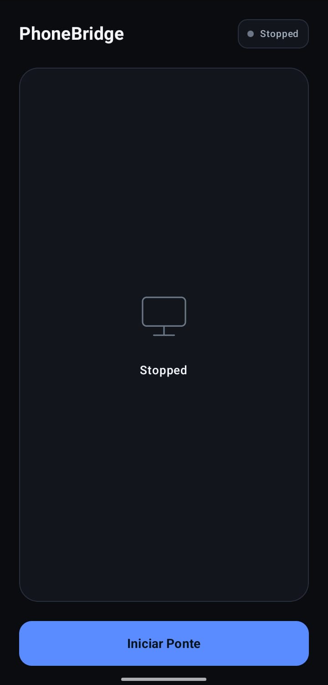
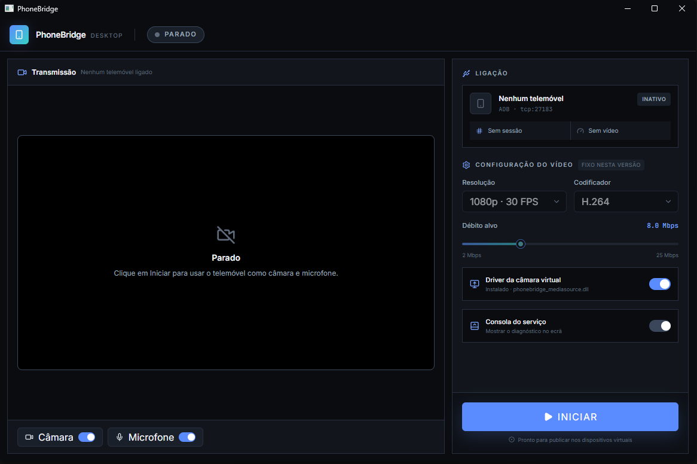

# PhoneBridge

**Use o telemóvel Android como câmara (e, em breve, microfone) do seu PC Windows — por USB, sem root, grátis e de código aberto.**


> **English, in short:** PhoneBridge streams your Android phone's camera to a Windows 11 PC over USB/ADB and exposes it as a virtual
> webcam (Media Foundation). It is free, GPL-3.0 and still experimental. The camera works in the Windows Camera app and web apps;
> OBS (DirectShow) and a real virtual microphone are not there yet. Docs are in Portuguese for now — issues and PRs in English are welcome.

### Android App
<p align="center">
  
  
</p>

---

## Índice

- [O que faz](#o-que-faz)
- [Estado atual](#estado-atual)
- [Como funciona](#como-funciona)
- [Requisitos](#requisitos)
- [Instalação (a partir do código)](#instala%C3%A7%C3%A3o-a-partir-do-c%C3%B3digo)
- [Utilização](#utiliza%C3%A7%C3%A3o)
- [Resolução de problemas](#resolu%C3%A7%C3%A3o-de-problemas)
- [Estrutura do projeto](#estrutura-do-projeto)
- [Desenvolvimento](#desenvolvimento)
- [Segurança e privacidade](#seguran%C3%A7a-e-privacidade)
- [Roadmap](#roadmap)
- [Contribuir](#contribuir)
- [Licença](#licen%C3%A7a)

---

## O que faz

- Transmite a **câmara traseira** do telemóvel (1080p · 30 fps, H.264 por hardware) para o PC por **USB**.
- Mostra-a no Windows como uma **câmara virtual** chamada **"Câmera (PhoneBridge)"**, que qualquer app compatível pode escolher.
- Tem uma **app Android** (Jetpack Compose) e uma **app Windows** (janela única, escura, com interruptores para Câmara e Microfone).
- Pensado para baixa latência: sem Wi-Fi, sem nuvem, sem contas. Tudo corre localmente.

## Estado atual

O PhoneBridge está em fase **experimental** (pré-1.0). O que funciona e o que não funciona, sem rodeios:

| Funcionalidade | Estado |
|---|---|
| Transporte USB/ADB, handshake, reconexão | ✅ implementado |
| Captura Android (Camera2 → H.264) e descodificação no PC | ✅ implementado |
| Câmara virtual (Media Foundation) na **Câmara do Windows** e em aplicações web | ✅ testado |
| App Windows com interruptores Câmara/Microfone em direto | ✅ implementado |
| Instalação do driver da câmara a partir da própria app | ✅ implementado |
| **Discord** | ⚠️ experimental — pode não listar a câmara |
| **OBS Studio** | ❌ ainda não — o OBS só lista câmaras DirectShow (ver [Roadmap](#roadmap)) |
| Teams, Zoom e outras | ❔ não testado |
| **Microfone no Windows** | ❌ o áudio é recebido e guardado em buffer, mas **não aparece como microfone** nas apps (precisa de um driver de áudio assinado) |
| Escolher câmara frontal/traseira, resolução e débito | ❌ valores fixos nesta versão: câmara traseira, 1080p, 30 fps, 8 Mbps |
| Pré-visualização dentro da app Windows | ❌ a imagem vai direta para a câmara virtual |

Lista completa em [`BUGS_AND_ROADMAP.md`](BUGS_AND_ROADMAP.md).

## Como funciona

```
 Android (Kotlin + Compose)                         PC Windows 11
┌─────────────────────────────┐                ┌────────────────────────────────────────────┐
│ Camera2 → MediaCodec H.264  │                │ PhoneBridge.exe  (WPF + WebView2, UI React)│
│ AudioRecord → PCM 48 kHz    │                │        │ JSON por linhas (stdin/stdout)    │
│ BridgeServer (socket local) │◀── USB / ADB ─▶│ phonebridge_service.exe  (C++20)           │
└─────────────────────────────┘ adb forward    │   ConnectionManager · VideoReceiver        │
                                tcp:27183 →    │   H.264 → NV12 (Media Foundation MFT)      │
                                localabstract: │        │ memória partilhada                │
                                phonebridge    │        ▼ Global\PhoneBridgeCameraFrame     │
                                               │ phonebridge_mediasource.dll  (COM)         │
                                               │   carregada pelo Windows Camera Frame Server│
                                               └──────────────────┬─────────────────────────┘
                                                                  ▼
                                                   Câmara do Windows · browsers · outras apps
```

1. A app Android escuta num socket local (`localabstract:phonebridge`) e aguarda o PC.
2. O motor do PC faz `adb forward`, liga-se, troca o handshake e pede câmara e/ou microfone ao telemóvel.
3. O vídeo H.264 é descodificado para NV12 e escrito numa **memória partilhada** de 3 posições.
4. Uma DLL COM (`phonebridge_mediasource.dll`), carregada pelo **Windows Camera Frame Server**, lê essa memória e entrega os frames às aplicações.
5. A janela do PhoneBridge arranca o motor (`--ui`) e controla-o por mensagens JSON, uma por linha.

O protocolo binário (cabeçalho de 28 bytes, pacotes de vídeo, áudio, controlo e *heartbeat*) está descrito em [`docs/spec.md`](docs/spec.md).

## Requisitos

**Telemóvel**
- Android 10 (API 29) ou superior, com **depuração USB** ativada e autorizada neste PC.

**PC**
- Windows 11 x64 (recomendado 22H2 ou posterior — a câmara virtual usa `MFCreateVirtualCamera`).
- [Android platform-tools (ADB)](https://developer.android.com/tools/releases/platform-tools) no `PATH`, ou o Android Studio instalado (o motor também procura em `%LOCALAPPDATA%\Android\Sdk\platform-tools`).
- [WebView2 Runtime](https://developer.microsoft.com/microsoft-edge/webview2/) (já vem com o Windows 11).
- [.NET 8 Desktop Runtime](https://dotnet.microsoft.com/download/dotnet/8.0) para correr a app publicada.
- Permissões de **administrador** (a câmara virtual regista uma DLL em `HKLM` e usa memória partilhada global).

**Para compilar**
- Visual Studio 2022 com *Desktop development with C++* e o Windows 11 SDK, e CMake 3.20+.
- .NET 8 SDK.
- Node.js 22+ (só se alterar o ecrã em `ui/`).
- Android Studio (JDK 17, SDK 34) para a app Android.

## Instalação (a partir do código)

Ainda não há versões prontas a descarregar: compila-se a partir do código.

### 1. App Android

1. Abra a pasta `android/` no Android Studio.
2. Ligue o telemóvel por USB (depuração USB autorizada) e execute a variante `debug`.
3. Abra a app **PhoneBridge** no telemóvel e toque em **Iniciar** (aceite as permissões de câmara, microfone e notificações).

### 2. Motor e câmara virtual (C++)

```powershell
cmake -S windows -B windows/build -A x64
cmake --build windows/build --config Release
```

Gera `windows/build/Release/phonebridge_service.exe` e `phonebridge_mediasource.dll`.

### 3. Ecrã da app (React) — só na primeira vez ou se o alterar

Os ficheiros compilados do ecrã não estão no repositório, por isso este passo é necessário:

```powershell
cd ui
npm ci
npm test
npm run build
cd ..
```

O resultado vai para `windows/app/PhoneBridge/wwwroot`.

### 4. App Windows

```powershell
dotnet publish windows/app/PhoneBridge/PhoneBridge.csproj -c Release -r win-x64 --self-contained false -o windows/dist/PhoneBridge
```

A pasta `windows/dist/PhoneBridge` fica com tudo o que é preciso (`PhoneBridge.exe`, o motor e a DLL da câmara). Pode copiá-la para onde quiser.

## Utilização

1. No telemóvel: abra a app PhoneBridge e toque em **Iniciar**.
2. No PC: abra `PhoneBridge.exe` (o Windows pede permissão de administrador) e clique em **INICIAR**.
   - Na primeira vez a app **instala sozinha o driver da câmara virtual**; demora alguns segundos.
3. Com os interruptores **Câmara** e **Microfone** escolha o que transmitir. As alterações aplicam-se em direto.
4. Numa aplicação de vídeo (por exemplo a **Câmara do Windows**), escolha **Câmera (PhoneBridge)**.

O painel da direita mostra a ligação, o nome do telemóvel, o FPS e a **consola do serviço** (com Copiar, Limpar e Reiniciar).
Para remover a câmara do sistema, desligue o interruptor **Driver da câmara virtual**.

> Dica: se a câmara não aparecer numa app que já estava aberta, feche-a por completo e abra-a de novo **depois** de o PhoneBridge estar a transmitir.

### Onde ficam os ficheiros

| O quê | Onde |
|---|---|
| Driver da câmara (DLL registada) | `C:\Program Files\PhoneBridge` |
| Registo do motor | `%LOCALAPPDATA%\PhoneBridge\engine.log` |
| Registo da câmara (Frame Server) | `C:\ProgramData\PhoneBridge\logs\phonebridge_camera.log` |
| Definições da app | `%APPDATA%\PhoneBridge\settings.json` |

## Resolução de problemas

| Sintoma | O que fazer |
|---|---|
| "A procurar o telemóvel" não passa | Cabo USB de dados, depuração USB autorizada, app Android aberta e em **Iniciar**. Teste com `adb devices`. |
| A janela abre em branco | Instale o WebView2 Runtime. Se faltar a pasta `wwwroot`, repita o passo 3 e volte a publicar. |
| A câmara não aparece numa app | Feche a app por completo e abra-a depois. Confirme que a **Câmara do Windows** a vê primeiro. Veja o interruptor do driver. |
| Imagem preta | Sem sinal do telemóvel a câmara mostra preto. Veja a consola e o FPS no painel. Para testar sem telemóvel, defina `PHONEBRIDGE_TEST_PATTERN=1` antes de abrir o motor. |
| Discord não lista a câmara | Reinicie o Discord (inclusive no tray), desative a aceleração de hardware e reselecione. Ver [`docs/diagnostics.md`](docs/diagnostics.md). |
| OBS não lista a câmara | Esperado por enquanto: o OBS só lista câmaras DirectShow. Ver [Roadmap](#roadmap). |
| Erro ao instalar o driver | Feche apps que usem a câmara (Câmara, Teams, Discord, OBS) e tente de novo. |

Ao reportar um problema, anexe a **consola do serviço** (botão *Copiar*) e o ficheiro `phonebridge_camera.log`.

Variáveis de ambiente úteis (opcionais):

| Variável | Efeito |
|---|---|
| `PHONEBRIDGE_TEST_PATTERN=1` | Mostra um padrão de teste quando não há vídeo |
| `PHONEBRIDGE_DUMP_H264=1` | Grava o fluxo H.264 bruto em `windows_output_video.h264` (cresce ~1 MB/s) |
| `PHONEBRIDGE_DIAGNOSTIC_WAV=1` | Grava o áudio recebido num WAV de diagnóstico |

## Estrutura do projeto

```
android/                 App Android (Kotlin, Compose, Camera2, MediaCodec, AudioRecord, JNI para o parser)
protocol/                Protocolo binário partilhado e parser incremental (C++)
windows/
  service/               Motor C++: transporte ADB, ligação, vídeo/áudio, canal de controlo (--ui)
  virtual-camera/        DLL COM da câmara virtual (Media Foundation) e memória partilhada
  app/PhoneBridge/       App Windows: janela WPF + WebView2 e lógica de controlo (C#)
  audio-driver/          Esboço do driver de microfone virtual (ainda não funcional)
  scripts/               Instalação/remoção manual da câmara (legado; a app já faz isto)
ui/                      Ecrã da app Windows (React + Vite + Tailwind)
tools/                   Scripts de teste e diagnóstico (PowerShell)
tests/protocol/          Testes do protocolo
docs/                    Especificação, diagnóstico, DirectShow, assinatura de drivers
```

## Desenvolvimento

**Testes**

```powershell
# Protocolo (C++)
cmake -S . -B build -DCMAKE_BUILD_TYPE=Debug
cmake --build build
ctest --test-dir build --output-on-failure

# Lógica do ecrã
cd ui && npm test
```

**Ecrã sem telemóvel nem motor:** `cd ui && npm run dev` abre o ecrã no browser com um simulador.

**Motor ↔ app:** o motor aceita `--ui` e fala em JSON por linhas.
Comandos: `{"cmd":"set","camera":true,"mic":false}` e `{"cmd":"quit"}`.
Eventos: `{"event":"status",...}`, `{"event":"ready"}`, `{"event":"error","code":"..."}`.
Definição em [`windows/service/control/control_protocol.h`](windows/service/control/control_protocol.h).

> Nota: nenhum destes componentes se dá por pronto só porque compila. A câmara virtual, o driver e a app têm de ser testados num Windows real.

## Segurança e privacidade

- Toda a comunicação é **local**: USB e `adb forward` para `127.0.0.1:27183`. O código do PhoneBridge não faz ligações à Internet.
- A app pede **administrador**: regista uma DLL COM em `HKLM` (carregada pelo serviço do Windows *Frame Server*) e cria a memória partilhada global.
- A memória partilhada `Global\PhoneBridgeCameraFrame` só pode ser aberta por SYSTEM, administradores e LOCAL SERVICE.
- Para remover tudo: desligue o interruptor do driver, apague `C:\Program Files\PhoneBridge`, `%LOCALAPPDATA%\PhoneBridge` e `%APPDATA%\PhoneBridge`.

## Roadmap

Detalhes em [`BUGS_AND_ROADMAP.md`](BUGS_AND_ROADMAP.md) e [`docs/directshow-compatibility.md`](docs/directshow-compatibility.md).

- [ ] **Filtro DirectShow** (x64) ligado à mesma memória partilhada, para o OBS e aplicações antigas. Requer dar leitura da memória partilhada ao utilizador normal.
- [ ] **Microfone virtual** (driver WaveRT/SYSVAD assinado) para Discord, Teams e browsers.
- [ ] Escolher câmara frontal/traseira, resolução e débito (requer alterações na app Android).
- [ ] Instalador (`PhoneBridge-Setup.exe`) e *releases* automáticas com GitHub Actions.
- [ ] Pré-visualização do vídeo na app Windows.
- [ ] Vários telemóveis, recuperação após suspensão e troca de USB.

## Contribuir

Contribuições são bem-vindas — código, testes em hardware diferente, documentação e relatórios de erros.

1. Abra uma *issue* a descrever o problema ou a ideia (com a consola e os registos, se for um erro).
2. Faça *fork*, crie um ramo e mantenha as alterações pequenas e focadas.
3. Corra os testes (`ctest` e `npm test`) e descreva **como testou** num Windows real.
4. Abra o *pull request*.

Seja claro sobre o que foi e o que não foi testado.

## Licença

[GPL-3.0](LICENSE). As dependências de terceiros (React, Vite, Tailwind CSS, lucide-react, fontes Inter e JetBrains Mono, Microsoft WebView2)
mantêm as suas próprias licenças; ver `ui/package.json` e `windows/app/PhoneBridge/PhoneBridge.csproj`.
